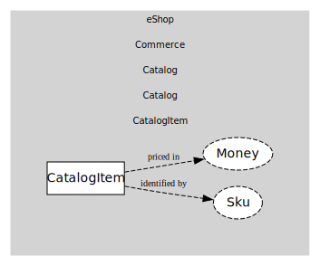

# CatalogItem
Sellable product item.

## Entities and Value Objects
| Type | Name | Description |
| --- | --- | --- |
| Entity (Root) | **CatalogItem** | Catalog item root with price and stock. |
| Value Object | Sku | Stock-keeping unit. |
| Value Object | Money | Amount + currency. |

## Relationships
| Source | Description | Target | Relation |
| --- | --- | --- | --- |
| [CatalogItem](entities/catalog_item/index.md) | identified by | CatalogItem - Sku | uses |
| [CatalogItem](entities/catalog_item/index.md) | priced in | CatalogItem - Money | uses |

## Invariants
> No invariants.

## Provides
> No consumables.

## Consumes
> No consumptions.
	
