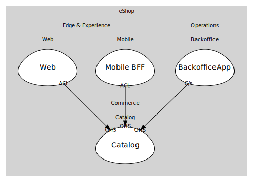

# Catalog
Manage and query product catalog.

## Bounded Contexts

### [Catalog](boundedcontexts/catalog/index.md)
Minimal API for catalog queries and management.

## Relationships
| Consumer | Consumed As | Provider | Consumable | Provided As |
| --- | --- | --- | --- | --- |
| [WebApp](../../../edge_&_experience/subdomains/web/boundedcontexts/web/services/web_app/index.md) | anti-corruption-layer | CatalogService | GetCatalogItems | open-host-service |
| [ShoppingBff](../../../edge_&_experience/subdomains/mobile/boundedcontexts/mobile_bff/services/shopping_bff/index.md) | anti-corruption-layer | CatalogService | GetCatalogItems | open-host-service |
| [Backoffice](../../../operations/subdomains/backoffice/boundedcontexts/backoffice_app/services/backoffice/index.md) | customer-supplier | CatalogService | ChangePrice | open-host-service |
	
	
