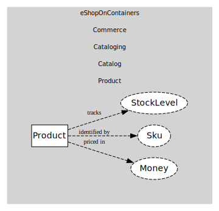

# Product
Sellable item with price & stock

## Entities and Value Objects
| Type | Name | Description |
| --- | --- | --- |
| Entity (Root) | **Product** | Product master |
| Value Object | Money | Amount + currency |
| Value Object | Sku | Stock keeping unit |
| Value Object | StockLevel | Available units |

## Relationships
| Source | Description | Target | Relation |
| --- | --- | --- | --- |
| [Product](entities/product/index.md) | priced in | Product - Money | uses |
| [Product](entities/product/index.md) | identified by | Product - Sku | uses |
| [Product](entities/product/index.md) | tracks | Product - StockLevel | uses |

## Invariants
| Name | Description |
| --- | --- |
| NonNegativePrice | Price >= 0 |
| NonNegativeStock | Stock >= 0 |

## Provides
> No consumables.

## Consumes
> No consumptions.
	
