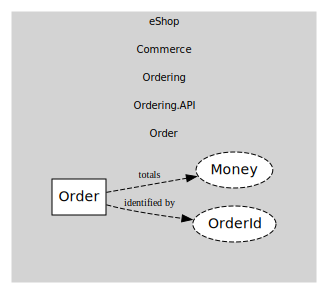

# Order
Order aggregate with status transitions.

## Entities and Value Objects
| Type | Name | Description |
| --- | --- | --- |
| Entity (Root) | **Order** | Order header. |
| Value Object | OrderId | Order identifier. |
| Value Object | Money | Totals & fees. |

## Relationships
| Source | Description | Target | Relation |
| --- | --- | --- | --- |
| [Order](entities/order/index.md) | identified by | Order - OrderId | uses |
| [Order](entities/order/index.md) | totals | Order - Money | uses |

## Invariants
| Name | Description |
| --- | --- |
| TotalsNonNegative | Order totals must be >= 0. |

## Provides
> No consumables.

## Consumes
> No consumptions.
	
