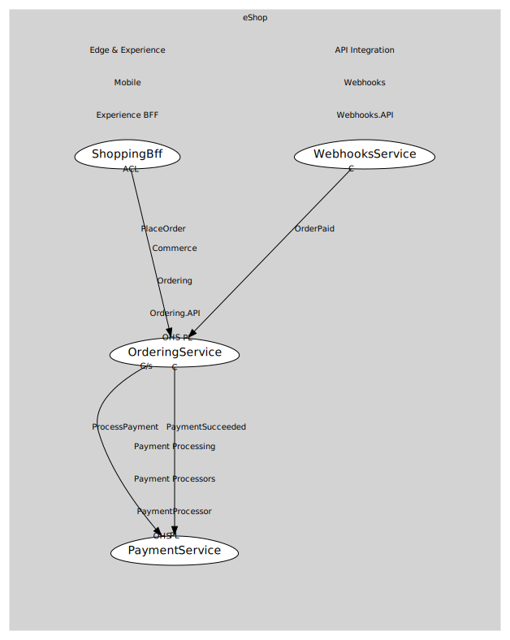

# OrderingService
Ordering application service.

## Provides

### (operation) - PlaceOrder [open-host-service]
Create an order from a valid basket.

### (event) - OrderPaid [published-language]
Integration event when an order is marked paid.

## Consumes

### ProcessPayment [customer-supplier]
Process/authorize payment for an order.
- **Provider**: [PaymentService](../../../../../../../payment_processing/subdomains/payment_processors/boundedcontexts/payment_processor/services/payment_service/index.md)

### PaymentSucceeded [conformist]
Integration event when a payment is successful.
- **Provider**: [PaymentService](../../../../../../../payment_processing/subdomains/payment_processors/boundedcontexts/payment_processor/services/payment_service/index.md)

	
