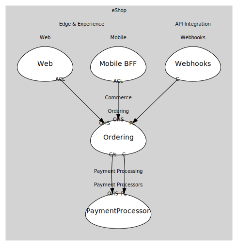

# Ordering
Order lifecycle and payments coordination.

## Bounded Contexts

### [Ordering](boundedcontexts/ordering/index.md)
Order lifecycle, status and events.

## Relationships
| Consumer | Consumed As | Provider | Consumable | Provided As |
| --- | --- | --- | --- | --- |
| [WebApp](../../../edge_&_experience/subdomains/web/boundedcontexts/web/services/web_app/index.md) | anti-corruption-layer | OrderingService | PlaceOrder | open-host-service |
| [ShoppingBff](../../../edge_&_experience/subdomains/mobile/boundedcontexts/mobile_bff/services/shopping_bff/index.md) | anti-corruption-layer | OrderingService | PlaceOrder | open-host-service |
| [WebhooksService](../../../api_integration/subdomains/webhooks/boundedcontexts/webhooks/services/webhooks_service/index.md) | conformist | OrderingService | OrderPaid | published-language |
| [OrderingService](boundedcontexts/ordering/services/ordering_service/index.md) | customer-supplier | PaymentService | ProcessPayment | open-host-service |
| [OrderingService](boundedcontexts/ordering/services/ordering_service/index.md) | conformist | PaymentService | PaymentSucceeded | published-language |
	
	
