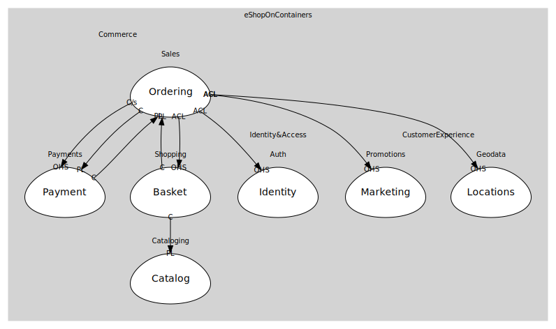

# Payment
Payment.API (sample)

## Aggregates
> No aggregates.
	
## Services

### [PaymentService](services/payment_service/index.md)
Authorize/Capture (sample)

## Relationships
| Consumer | Consumed As | Provider | Consumable | Provided As |
| --- | --- | --- | --- | --- |
| [OrderingWorkflow](../../../sales/boundedcontexts/ordering/services/ordering_workflow/index.md) | customer-supplier | PaymentService | AuthorizePayment | open-host-service |
| [OrderingWorkflow](../../../sales/boundedcontexts/ordering/services/ordering_workflow/index.md) | customer-supplier | PaymentService | CapturePayment | open-host-service |
| [OrderingWorkflow](../../../sales/boundedcontexts/ordering/services/ordering_workflow/index.md) | conformist | PaymentService | PaymentStatusChanged | published-language |
| [PaymentService](services/payment_service/index.md) | conformist | OrderingApp | OrderStarted | published-language |
| [OrderingApp](../../../sales/boundedcontexts/ordering/services/ordering_app/index.md) | anti-corruption-layer | BasketService | GetBasket | open-host-service |
| [BasketService](../../../shopping/boundedcontexts/basket/services/basket_service/index.md) | conformist | CatalogService | ProductPriceChanged | published-language |
| [BasketService](../../../shopping/boundedcontexts/basket/services/basket_service/index.md) | conformist | OrderingApp | OrderStarted | published-language |
| [OrderingApp](../../../sales/boundedcontexts/ordering/services/ordering_app/index.md) | anti-corruption-layer | IdentityService | IssueToken | open-host-service |
| [OrderingApp](../../../sales/boundedcontexts/ordering/services/ordering_app/index.md) | anti-corruption-layer | MarketingService | ApplyCampaigns | open-host-service |
| [OrderingApp](../../../sales/boundedcontexts/ordering/services/ordering_app/index.md) | anti-corruption-layer | LocationsService | ResolveLocation | open-host-service |

