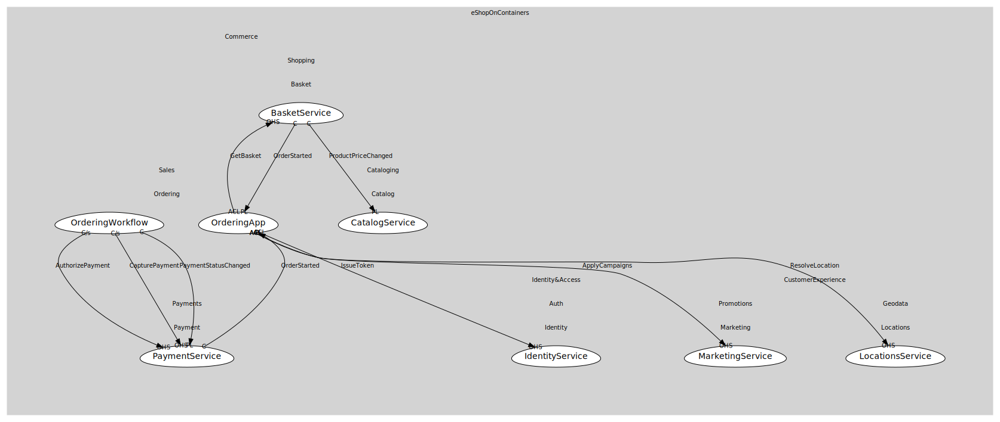

# PaymentService
Authorize/Capture (sample)

## Provides

### (operation) - AuthorizePayment [open-host-service]
Authorize order amount

### (operation) - CapturePayment [open-host-service]
Capture funds

### (event) - PaymentStatusChanged [published-language]
Payment authorized/captured/failed

## Consumes

### OrderStarted [conformist]
Order submitted
- **Provider**: [OrderingApp](../../../../../sales/boundedcontexts/ordering/services/ordering_app/index.md)

	
