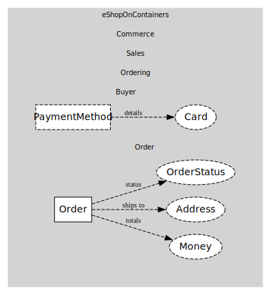

# Buyer
Purchaser + payment methods

## Entities and Value Objects
| Type | Name | Description |
| --- | --- | --- |
| Entity (Root) | **Buyer** | Buyer identity within Ordering BC |
| Entity | PaymentMethod | Stored method (masked PAN/expiry) |
| Value Object | Card | Masked card data |

## Relationships
| Source | Description | Target | Relation |
| --- | --- | --- | --- |
| [Order](../order/entities/order/index.md) | totals | Order - Money | uses |
| [Order](../order/entities/order/index.md) | ships to | Order - Address | uses |
| [Order](../order/entities/order/index.md) | status | Order - OrderStatus | uses |
| [PaymentMethod](entities/payment_method/index.md) | details | Buyer - Card | uses |

## Invariants
> No invariants.

## Provides
> No consumables.

## Consumes
> No consumptions.
	
