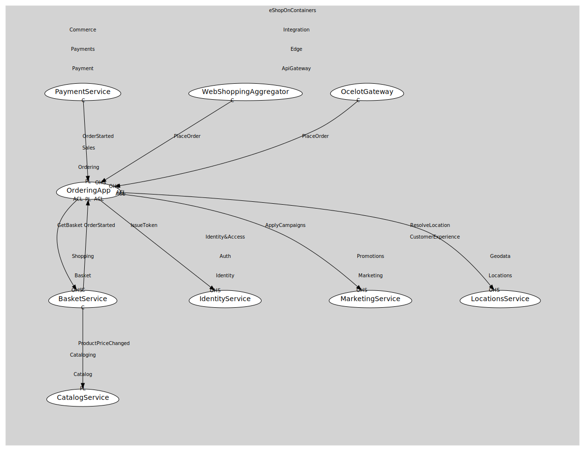

# OrderingApp
Start/Place orders

## Provides

### (operation) - StartCheckout [open-host-service]
Create pending order from basket

### (operation) - PlaceOrder [open-host-service]
Submit order -> OrderStarted

### (event) - OrderStarted [published-language]
Order submitted

## Consumes

### GetBasket [anti-corruption-layer]
Fetch buyer basket
- **Provider**: [BasketService](../../../../../shopping/boundedcontexts/basket/services/basket_service/index.md)

### IssueToken [anti-corruption-layer]
Exchange creds for JWT
- **Provider**: [IdentityService](../../../../../../../identity&access/subdomains/auth/boundedcontexts/identity/services/identity_service/index.md)

### ApplyCampaigns [anti-corruption-layer]
Calculate discounts for basket/order
- **Provider**: [MarketingService](../../../../../../../customer_experience/subdomains/promotions/boundedcontexts/marketing/services/marketing_service/index.md)

### ResolveLocation [anti-corruption-layer]
Resolve/validate address/geo
- **Provider**: [LocationsService](../../../../../../../customer_experience/subdomains/geodata/boundedcontexts/locations/services/locations_service/index.md)

	
