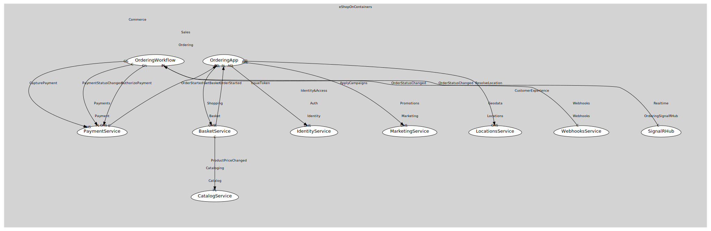

# OrderingWorkflow
Policies, coordination

## Provides

### (operation) - MarkOrderPaid [open-host-service]
Transition to Paid

### (event) - OrderStatusChanged [published-language]
Order state transition

## Consumes

### AuthorizePayment [customer-supplier]
Authorize order amount
- **Provider**: [PaymentService](../../../../../payments/boundedcontexts/payment/services/payment_service/index.md)

### CapturePayment [customer-supplier]
Capture funds
- **Provider**: [PaymentService](../../../../../payments/boundedcontexts/payment/services/payment_service/index.md)

### PaymentStatusChanged [conformist]
Payment authorized/captured/failed
- **Provider**: [PaymentService](../../../../../payments/boundedcontexts/payment/services/payment_service/index.md)

	
