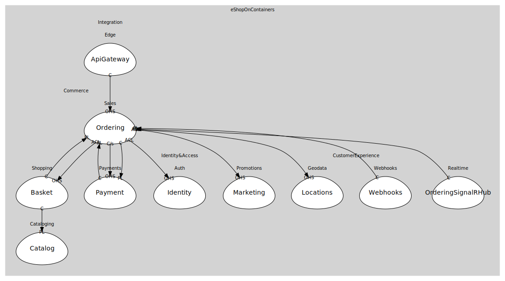

# Sales
Order lifecycle & buyer

## Bounded Contexts

### [Ordering](boundedcontexts/ordering/index.md)
Ordering.API (rich DDD + domain events)

## Relationships
| Consumer | Consumed As | Provider | Consumable | Provided As |
| --- | --- | --- | --- | --- |
| [WebShoppingAggregator](../../../integration/subdomains/edge/boundedcontexts/api_gateway/services/web_shopping_aggregator/index.md) | conformist | OrderingApp | PlaceOrder | open-host-service |
| [OcelotGateway](../../../integration/subdomains/edge/boundedcontexts/api_gateway/services/ocelot_gateway/index.md) | conformist | OrderingApp | PlaceOrder | open-host-service |
| [BasketService](../shopping/boundedcontexts/basket/services/basket_service/index.md) | conformist | OrderingApp | OrderStarted | published-language |
| [PaymentService](../payments/boundedcontexts/payment/services/payment_service/index.md) | conformist | OrderingApp | OrderStarted | published-language |
| [OrderingApp](boundedcontexts/ordering/services/ordering_app/index.md) | anti-corruption-layer | BasketService | GetBasket | open-host-service |
| [BasketService](../shopping/boundedcontexts/basket/services/basket_service/index.md) | conformist | CatalogService | ProductPriceChanged | published-language |
| [OrderingApp](boundedcontexts/ordering/services/ordering_app/index.md) | anti-corruption-layer | IdentityService | IssueToken | open-host-service |
| [OrderingApp](boundedcontexts/ordering/services/ordering_app/index.md) | anti-corruption-layer | MarketingService | ApplyCampaigns | open-host-service |
| [OrderingApp](boundedcontexts/ordering/services/ordering_app/index.md) | anti-corruption-layer | LocationsService | ResolveLocation | open-host-service |
| [WebhooksService](../../../customer_experience/subdomains/webhooks/boundedcontexts/webhooks/services/webhooks_service/index.md) | conformist | OrderingWorkflow | OrderStatusChanged | published-language |
| [SignalRHub](../../../customer_experience/subdomains/realtime/boundedcontexts/ordering_signal_rhub/services/signal_rhub/index.md) | conformist | OrderingWorkflow | OrderStatusChanged | published-language |
| [OrderingWorkflow](boundedcontexts/ordering/services/ordering_workflow/index.md) | customer-supplier | PaymentService | AuthorizePayment | open-host-service |
| [OrderingWorkflow](boundedcontexts/ordering/services/ordering_workflow/index.md) | customer-supplier | PaymentService | CapturePayment | open-host-service |
| [OrderingWorkflow](boundedcontexts/ordering/services/ordering_workflow/index.md) | conformist | PaymentService | PaymentStatusChanged | published-language |
	
	
