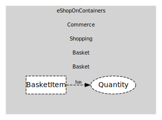

# Basket
Transient cart

## Entities and Value Objects
| Type | Name | Description |
| --- | --- | --- |
| Entity (Root) | **Basket** | Basket header |
| Entity | BasketItem | Product + quantity + unit price snapshot |
| Value Object | Quantity | Positive integer |

## Relationships
| Source | Description | Target | Relation |
| --- | --- | --- | --- |
| [BasketItem](entities/basket_item/index.md) | has | Basket - Quantity | uses |

## Invariants
| Name | Description |
| --- | --- |
| QtyPositive | Quantity > 0 |

## Provides
> No consumables.

## Consumes
> No consumptions.
	
