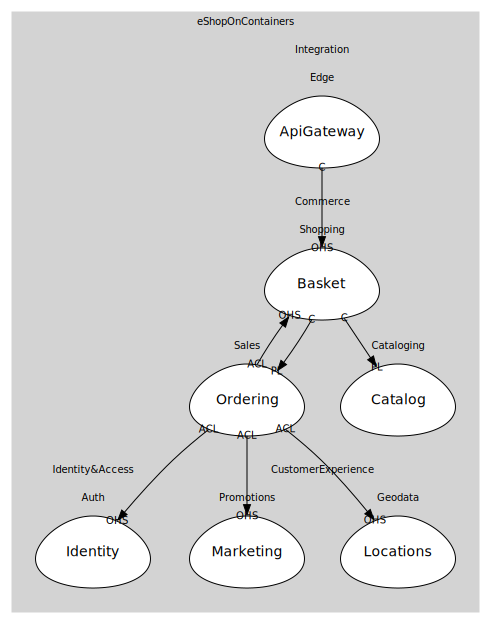

# Shopping
Basket/cart before checkout

## Bounded Contexts

### [Basket](boundedcontexts/basket/index.md)
Basket.API (Redis)

## Relationships
| Consumer | Consumed As | Provider | Consumable | Provided As |
| --- | --- | --- | --- | --- |
| [WebShoppingAggregator](../../../integration/subdomains/edge/boundedcontexts/api_gateway/services/web_shopping_aggregator/index.md) | conformist | BasketService | GetBasket | open-host-service |
| [OcelotGateway](../../../integration/subdomains/edge/boundedcontexts/api_gateway/services/ocelot_gateway/index.md) | conformist | BasketService | GetBasket | open-host-service |
| [OrderingApp](../sales/boundedcontexts/ordering/services/ordering_app/index.md) | anti-corruption-layer | BasketService | GetBasket | open-host-service |
| [BasketService](boundedcontexts/basket/services/basket_service/index.md) | conformist | CatalogService | ProductPriceChanged | published-language |
| [BasketService](boundedcontexts/basket/services/basket_service/index.md) | conformist | OrderingApp | OrderStarted | published-language |
| [OrderingApp](../sales/boundedcontexts/ordering/services/ordering_app/index.md) | anti-corruption-layer | IdentityService | IssueToken | open-host-service |
| [OrderingApp](../sales/boundedcontexts/ordering/services/ordering_app/index.md) | anti-corruption-layer | MarketingService | ApplyCampaigns | open-host-service |
| [OrderingApp](../sales/boundedcontexts/ordering/services/ordering_app/index.md) | anti-corruption-layer | LocationsService | ResolveLocation | open-host-service |
	
	
