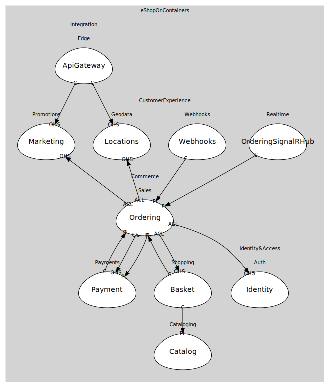

# CustomerExperience (supporting)
Marketing, locations, webhooks, realtime

## Subdomains

### [Promotions](subdomains/promotions/index.md)
Campaigns, discounts

### [Geodata](subdomains/geodata/index.md)
Locations and related data

### [Webhooks](subdomains/webhooks/index.md)
3rd-party callbacks on updates

### [Realtime](subdomains/realtime/index.md)
SignalR hub to push updates

## Relationships
| Consumer | Consumed As | Provider | Consumable | Provided As |
| --- | --- | --- | --- | --- |
| [MobileShoppingAggregator](../integration/subdomains/edge/boundedcontexts/api_gateway/services/mobile_shopping_aggregator/index.md) | conformist | MarketingService | ApplyCampaigns | open-host-service |
| [OrderingApp](../commerce/subdomains/sales/boundedcontexts/ordering/services/ordering_app/index.md) | anti-corruption-layer | MarketingService | ApplyCampaigns | open-host-service |
| [MobileShoppingAggregator](../integration/subdomains/edge/boundedcontexts/api_gateway/services/mobile_shopping_aggregator/index.md) | conformist | LocationsService | ResolveLocation | open-host-service |
| [OrderingApp](../commerce/subdomains/sales/boundedcontexts/ordering/services/ordering_app/index.md) | anti-corruption-layer | LocationsService | ResolveLocation | open-host-service |
| [WebhooksService](subdomains/webhooks/boundedcontexts/webhooks/services/webhooks_service/index.md) | conformist | OrderingWorkflow | OrderStatusChanged | published-language |
| [OrderingWorkflow](../commerce/subdomains/sales/boundedcontexts/ordering/services/ordering_workflow/index.md) | customer-supplier | PaymentService | AuthorizePayment | open-host-service |
| [PaymentService](../commerce/subdomains/payments/boundedcontexts/payment/services/payment_service/index.md) | conformist | OrderingApp | OrderStarted | published-language |
| [OrderingApp](../commerce/subdomains/sales/boundedcontexts/ordering/services/ordering_app/index.md) | anti-corruption-layer | BasketService | GetBasket | open-host-service |
| [BasketService](../commerce/subdomains/shopping/boundedcontexts/basket/services/basket_service/index.md) | conformist | CatalogService | ProductPriceChanged | published-language |
| [BasketService](../commerce/subdomains/shopping/boundedcontexts/basket/services/basket_service/index.md) | conformist | OrderingApp | OrderStarted | published-language |
| [OrderingApp](../commerce/subdomains/sales/boundedcontexts/ordering/services/ordering_app/index.md) | anti-corruption-layer | IdentityService | IssueToken | open-host-service |
| [OrderingWorkflow](../commerce/subdomains/sales/boundedcontexts/ordering/services/ordering_workflow/index.md) | customer-supplier | PaymentService | CapturePayment | open-host-service |
| [OrderingWorkflow](../commerce/subdomains/sales/boundedcontexts/ordering/services/ordering_workflow/index.md) | conformist | PaymentService | PaymentStatusChanged | published-language |
| [SignalRHub](subdomains/realtime/boundedcontexts/ordering_signal_rhub/services/signal_rhub/index.md) | conformist | OrderingWorkflow | OrderStatusChanged | published-language |

	
