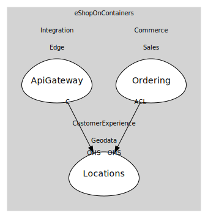

# Locations
Locations.API

## Aggregates
> No aggregates.
	
## Services

### [LocationsService](services/locations_service/index.md)
Resolve/validate location data

## Relationships
| Consumer | Consumed As | Provider | Consumable | Provided As |
| --- | --- | --- | --- | --- |
| [MobileShoppingAggregator](../../../../../integration/subdomains/edge/boundedcontexts/api_gateway/services/mobile_shopping_aggregator/index.md) | conformist | LocationsService | ResolveLocation | open-host-service |
| [OrderingApp](../../../../../commerce/subdomains/sales/boundedcontexts/ordering/services/ordering_app/index.md) | anti-corruption-layer | LocationsService | ResolveLocation | open-host-service |

