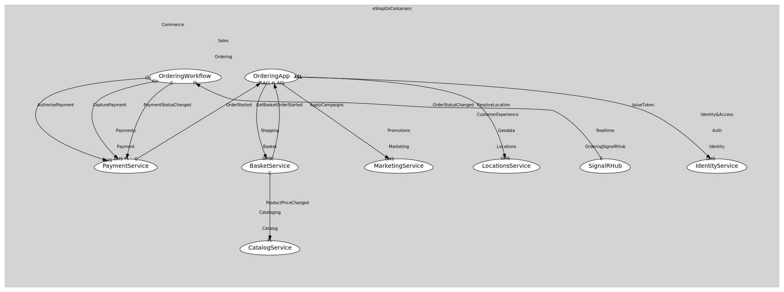

# SignalRHub
Push notifications to clients

## Provides
> No consumables.

## Consumes

### OrderStatusChanged [conformist]
Order state transition
- **Provider**: [OrderingWorkflow](../../../../../../../commerce/subdomains/sales/boundedcontexts/ordering/services/ordering_workflow/index.md)

	
