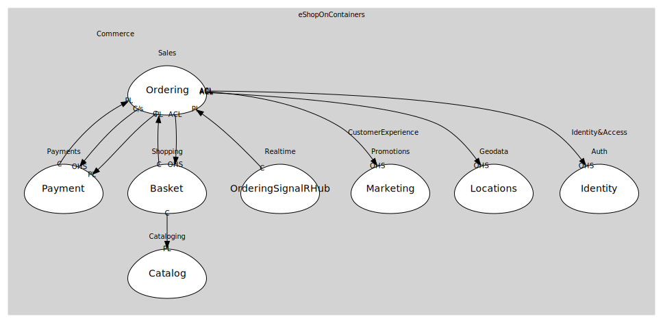

# Realtime
SignalR hub to push updates

## Bounded Contexts

### [OrderingSignalRHub](boundedcontexts/ordering_signal_rhub/index.md)
Ordering.SignalRHub

## Relationships
| Consumer | Consumed As | Provider | Consumable | Provided As |
| --- | --- | --- | --- | --- |
| [SignalRHub](boundedcontexts/ordering_signal_rhub/services/signal_rhub/index.md) | conformist | OrderingWorkflow | OrderStatusChanged | published-language |
| [OrderingWorkflow](../../../commerce/subdomains/sales/boundedcontexts/ordering/services/ordering_workflow/index.md) | customer-supplier | PaymentService | AuthorizePayment | open-host-service |
| [PaymentService](../../../commerce/subdomains/payments/boundedcontexts/payment/services/payment_service/index.md) | conformist | OrderingApp | OrderStarted | published-language |
| [OrderingApp](../../../commerce/subdomains/sales/boundedcontexts/ordering/services/ordering_app/index.md) | anti-corruption-layer | BasketService | GetBasket | open-host-service |
| [BasketService](../../../commerce/subdomains/shopping/boundedcontexts/basket/services/basket_service/index.md) | conformist | CatalogService | ProductPriceChanged | published-language |
| [BasketService](../../../commerce/subdomains/shopping/boundedcontexts/basket/services/basket_service/index.md) | conformist | OrderingApp | OrderStarted | published-language |
| [OrderingApp](../../../commerce/subdomains/sales/boundedcontexts/ordering/services/ordering_app/index.md) | anti-corruption-layer | IdentityService | IssueToken | open-host-service |
| [OrderingApp](../../../commerce/subdomains/sales/boundedcontexts/ordering/services/ordering_app/index.md) | anti-corruption-layer | MarketingService | ApplyCampaigns | open-host-service |
| [OrderingApp](../../../commerce/subdomains/sales/boundedcontexts/ordering/services/ordering_app/index.md) | anti-corruption-layer | LocationsService | ResolveLocation | open-host-service |
| [OrderingWorkflow](../../../commerce/subdomains/sales/boundedcontexts/ordering/services/ordering_workflow/index.md) | customer-supplier | PaymentService | CapturePayment | open-host-service |
| [OrderingWorkflow](../../../commerce/subdomains/sales/boundedcontexts/ordering/services/ordering_workflow/index.md) | conformist | PaymentService | PaymentStatusChanged | published-language |
	
	
