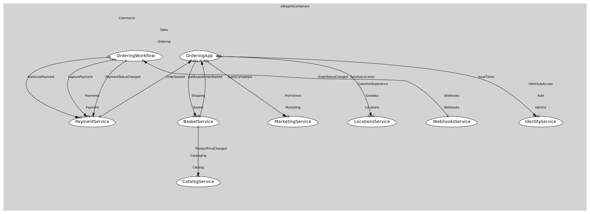

# WebhooksService
Manage subscriptions & push callbacks

## Provides

### (operation) - SubscribeWebhook [open-host-service]
Register webhook

## Consumes

### OrderStatusChanged [conformist]
Order state transition
- **Provider**: [OrderingWorkflow](../../../../../../../commerce/subdomains/sales/boundedcontexts/ordering/services/ordering_workflow/index.md)

	
