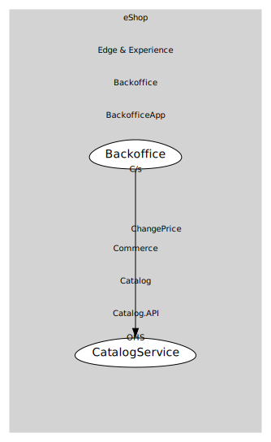

# Backoffice
Uses open-host operations for admin workflows.

## Provides
> No consumables.

## Consumes

### ChangePrice [customer-supplier]
Admin operation to change item price.
- **Provider**: [CatalogService](../../../../../../../commerce/subdomains/catalog/boundedcontexts/catalog.api/services/catalog_service/index.md)

	
