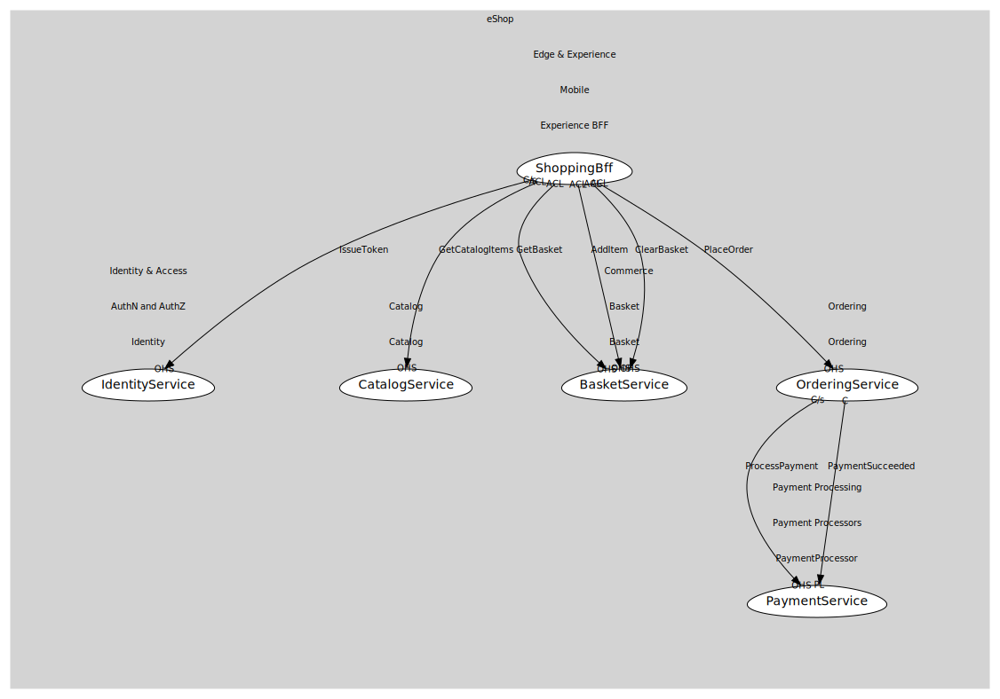

# ShoppingBff
Aggregation endpoints for shopping journeys.

## Provides
> No consumables.

## Consumes

### IssueToken [customer-supplier]
Obtain access/id tokens via OIDC flows.
- **Provider**: [IdentityService](../../../../../../../identity_&_access/subdomains/auth_n_and_auth_z/boundedcontexts/identity/services/identity_service/index.md)

### GetCatalogItems [anti-corruption-layer]
Browse/search catalog items.
- **Provider**: [CatalogService](../../../../../../../commerce/subdomains/catalog/boundedcontexts/catalog/services/catalog_service/index.md)

### GetBasket [anti-corruption-layer]
Fetch basket by user.
- **Provider**: [BasketService](../../../../../../../commerce/subdomains/basket/boundedcontexts/basket/services/basket_service/index.md)

### AddItem [anti-corruption-layer]
Add/merge an item into basket.
- **Provider**: [BasketService](../../../../../../../commerce/subdomains/basket/boundedcontexts/basket/services/basket_service/index.md)

### ClearBasket [anti-corruption-layer]
Remove all items from basket.
- **Provider**: [BasketService](../../../../../../../commerce/subdomains/basket/boundedcontexts/basket/services/basket_service/index.md)

### PlaceOrder [anti-corruption-layer]
Create an order from a valid basket.
- **Provider**: [OrderingService](../../../../../../../commerce/subdomains/ordering/boundedcontexts/ordering/services/ordering_service/index.md)

	
