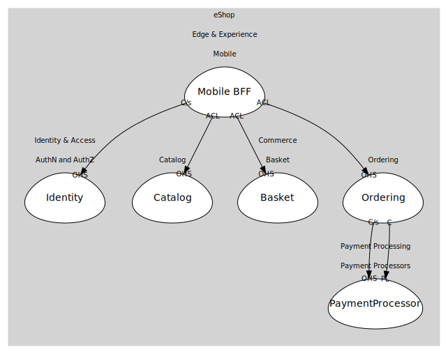

# Mobile
Mobile BFF/aggregator for shopping flows.

## Bounded Contexts

### [Mobile BFF](boundedcontexts/mobile_bff/index.md)
BFF that aggregates catalog/basket/ordering.

## Relationships
| Consumer | Consumed As | Provider | Consumable | Provided As |
| --- | --- | --- | --- | --- |
| [ShoppingBff](boundedcontexts/mobile_bff/services/shopping_bff/index.md) | customer-supplier | IdentityService | IssueToken | open-host-service |
| [ShoppingBff](boundedcontexts/mobile_bff/services/shopping_bff/index.md) | anti-corruption-layer | CatalogService | GetCatalogItems | open-host-service |
| [ShoppingBff](boundedcontexts/mobile_bff/services/shopping_bff/index.md) | anti-corruption-layer | BasketService | GetBasket | open-host-service |
| [ShoppingBff](boundedcontexts/mobile_bff/services/shopping_bff/index.md) | anti-corruption-layer | BasketService | AddItem | open-host-service |
| [ShoppingBff](boundedcontexts/mobile_bff/services/shopping_bff/index.md) | anti-corruption-layer | BasketService | ClearBasket | open-host-service |
| [ShoppingBff](boundedcontexts/mobile_bff/services/shopping_bff/index.md) | anti-corruption-layer | OrderingService | PlaceOrder | open-host-service |
| [OrderingService](../../../commerce/subdomains/ordering/boundedcontexts/ordering/services/ordering_service/index.md) | customer-supplier | PaymentService | ProcessPayment | open-host-service |
| [OrderingService](../../../commerce/subdomains/ordering/boundedcontexts/ordering/services/ordering_service/index.md) | conformist | PaymentService | PaymentSucceeded | published-language |
	
	
