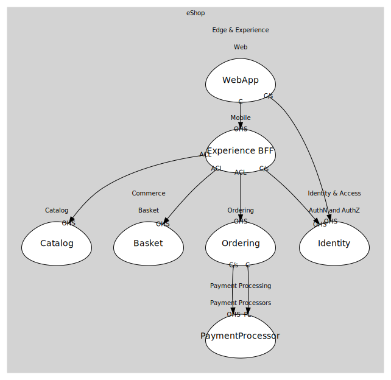

# WebApp
Blazor Server web app for customers.

## Aggregates
> No aggregates.
	
## Services

### [WebFrontend](services/web_frontend/index.md)
UI that talks mainly to the Mobile BFF.

## Relationships
| Consumer | Consumed As | Provider | Consumable | Provided As |
| --- | --- | --- | --- | --- |
| [WebFrontend](services/web_frontend/index.md) | customer-supplier | IdentityService | IssueToken | open-host-service |
| [WebFrontend](services/web_frontend/index.md) | conformist | ShoppingBff | GetHomeData | open-host-service |
| [ShoppingBff](../../../mobile/boundedcontexts/experience_bff/services/shopping_bff/index.md) | customer-supplier | IdentityService | IssueToken | open-host-service |
| [ShoppingBff](../../../mobile/boundedcontexts/experience_bff/services/shopping_bff/index.md) | anti-corruption-layer | CatalogService | GetCatalogItems | open-host-service |
| [ShoppingBff](../../../mobile/boundedcontexts/experience_bff/services/shopping_bff/index.md) | anti-corruption-layer | BasketService | GetBasket | open-host-service |
| [ShoppingBff](../../../mobile/boundedcontexts/experience_bff/services/shopping_bff/index.md) | anti-corruption-layer | BasketService | AddItem | open-host-service |
| [ShoppingBff](../../../mobile/boundedcontexts/experience_bff/services/shopping_bff/index.md) | anti-corruption-layer | BasketService | ClearBasket | open-host-service |
| [ShoppingBff](../../../mobile/boundedcontexts/experience_bff/services/shopping_bff/index.md) | anti-corruption-layer | OrderingService | PlaceOrder | open-host-service |
| [OrderingService](../../../../../commerce/subdomains/ordering/boundedcontexts/ordering/services/ordering_service/index.md) | customer-supplier | PaymentService | ProcessPayment | open-host-service |
| [OrderingService](../../../../../commerce/subdomains/ordering/boundedcontexts/ordering/services/ordering_service/index.md) | conformist | PaymentService | PaymentSucceeded | published-language |

