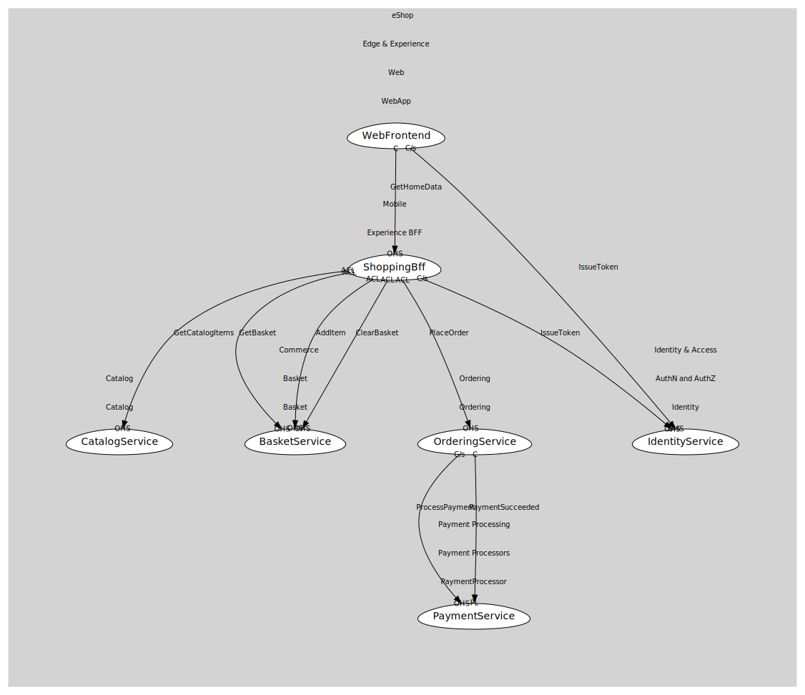

# WebFrontend
UI that talks mainly to the Mobile BFF.

## Provides
> No consumables.

## Consumes

### IssueToken [customer-supplier]
Obtain access/id tokens via OIDC flows.
- **Provider**: [IdentityService](../../../../../../../identity_&_access/subdomains/auth_n_and_auth_z/boundedcontexts/identity/services/identity_service/index.md)

### GetHomeData [conformist]
Representative BFF endpoint (aggregated landing data).
- **Provider**: [ShoppingBff](../../../../../mobile/boundedcontexts/experience_bff/services/shopping_bff/index.md)

	
