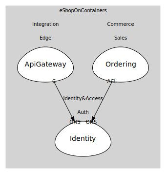

# Identity&Access (supporting)
AuthN/AuthZ, buyer identity

## Subdomains

### [Auth](subdomains/auth/index.md)
Identity server/token service

## Relationships
| Consumer | Consumed As | Provider | Consumable | Provided As |
| --- | --- | --- | --- | --- |
| [OcelotGateway](../integration/subdomains/edge/boundedcontexts/api_gateway/services/ocelot_gateway/index.md) | conformist | IdentityService | IssueToken | open-host-service |
| [OrderingApp](../commerce/subdomains/sales/boundedcontexts/ordering/services/ordering_app/index.md) | anti-corruption-layer | IdentityService | IssueToken | open-host-service |

	
