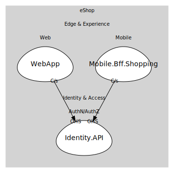

# Identity.API
Duende IdentityServer-based OIDC provider. Issues tokens that backends validate, enabling claims-based auth across the solution.

## Aggregates
> No aggregates.
	
## Services

### [IdentityService](services/identity_service/index.md)
Service boundary for token issuance and discovery endpoints. Other apps redirect here for login and token flows.

## Relationships
| Consumer | Consumed As | Provider | Consumable | Provided As |
| --- | --- | --- | --- | --- |
| [WebFrontend](../../../../../../edge_&_experience/subdomains/web/boundedcontexts/web_app/services/web_frontend/index.md) | customer-supplier | IdentityService | IssueToken | open-host-service |
| [ShoppingBff](../../../../../../edge_&_experience/subdomains/mobile/boundedcontexts/mobile.bff.shopping/services/shopping_bff/index.md) | customer-supplier | IdentityService | IssueToken | open-host-service |

