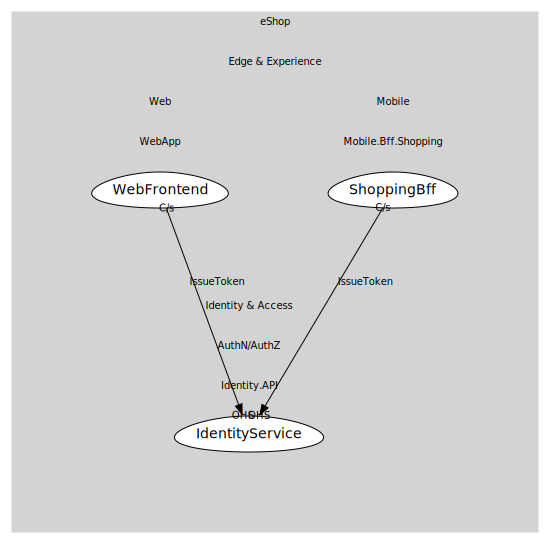

# IdentityService
Service boundary for token issuance and discovery endpoints. Other apps redirect here for login and token flows.

## Provides

### (operation) - IssueToken [open-host-service]
Open-hosted operation representing OIDC token acquisition (auth code, refresh, etc.). Clients/BFFs depend on this to call protected APIs.

## Consumes
> No consumptions.
	
