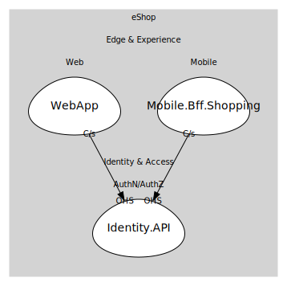

# AuthN/AuthZ
Identity provider concerns: login, consent, claims, and token issuance. Other services do not manage users directly—they rely on tokens and claims issued here.

## Bounded Contexts

### [Identity.API](boundedcontexts/identity.api/index.md)
Duende IdentityServer-based OIDC provider. Issues tokens that backends validate, enabling claims-based auth across the solution.

## Relationships
| Consumer | Consumed As | Provider | Consumable | Provided As |
| --- | --- | --- | --- | --- |
| [WebFrontend](../../../../edge_&_experience/subdomains/web/boundedcontexts/web_app/services/web_frontend/index.md) | customer-supplier | IdentityService | IssueToken | open-host-service |
| [ShoppingBff](../../../../edge_&_experience/subdomains/mobile/boundedcontexts/mobile.bff.shopping/services/shopping_bff/index.md) | customer-supplier | IdentityService | IssueToken | open-host-service |
	
	
