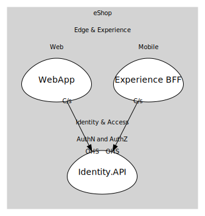

# Identity.API
Identity provider (Duende IdentityServer / OIDC).

## Aggregates
> No aggregates.
	
## Services

### [IdentityService](services/identity_service/index.md)
Token service for authN/authZ.

## Relationships
| Consumer | Consumed As | Provider | Consumable | Provided As |
| --- | --- | --- | --- | --- |
| [WebFrontend](../../../../../edge_&_experience/subdomains/web/boundedcontexts/web_app/services/web_frontend/index.md) | customer-supplier | IdentityService | IssueToken | open-host-service |
| [ShoppingBff](../../../../../edge_&_experience/subdomains/mobile/boundedcontexts/experience_bff/services/shopping_bff/index.md) | customer-supplier | IdentityService | IssueToken | open-host-service |

