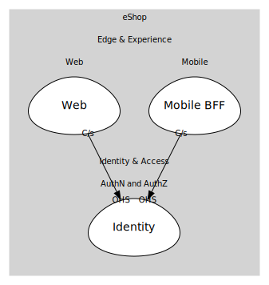

# AuthN and AuthZ
OpenID Connect identity provider.

## Bounded Contexts

### [Identity](boundedcontexts/identity/index.md)
Identity provider (Duende IdentityServer / OIDC).

## Relationships
| Consumer | Consumed As | Provider | Consumable | Provided As |
| --- | --- | --- | --- | --- |
| [WebApp](../../../edge_&_experience/subdomains/web/boundedcontexts/web/services/web_app/index.md) | customer-supplier | IdentityService | IssueToken | open-host-service |
| [ShoppingBff](../../../edge_&_experience/subdomains/mobile/boundedcontexts/mobile_bff/services/shopping_bff/index.md) | customer-supplier | IdentityService | IssueToken | open-host-service |
	
	
