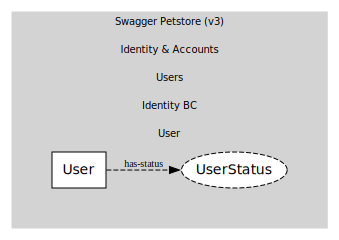

# User
Petstore user record

## Entities and Value Objects
| Type | Name | Description |
| --- | --- | --- |
| Entity (Root) | **User** | username, firstName, lastName, email, password, phone, userStatus(int) |
| Value Object | UserStatus | int (per Petstore v3 model) |

## Relationships
| Source | Description | Target | Relation |
| --- | --- | --- | --- |
| [User](entities/user/index.md) | has-status | User - UserStatus | uses |

## Invariants
> No invariants.

## Provides

### (event) - UserRegistered [published-language]
New user created

### (event) - UserUpdated [published-language]
User fields updated

### (event) - UserDeleted [published-language]
User removed

### (event) - UserLoggedIn [published-language]
Login via /user/login

### (event) - UserLoggedOut [published-language]
Logout via /user/logout

## Consumes
> No consumptions.
	
