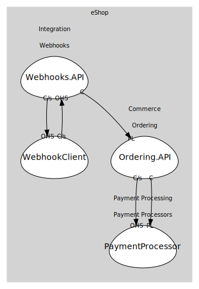

# Integration (supporting)
Cross-cutting integration (webhooks, external processors).

## Subdomains

### [Webhooks](subdomains/webhooks/index.md)
Webhook registration and event delivery.

## Relationships
| Consumer | Consumed As | Provider | Consumable | Provided As |
| --- | --- | --- | --- | --- |
| [WebhookReceiver](subdomains/webhooks/boundedcontexts/webhook_client/services/webhook_receiver/index.md) | customer-supplier | WebhooksService | RegisterWebhook | open-host-service |
| [WebhooksService](subdomains/webhooks/boundedcontexts/webhooks.api/services/webhooks_service/index.md) | conformist | OrderingService | OrderPaid | published-language |
| [OrderingService](../commerce/subdomains/ordering/boundedcontexts/ordering.api/services/ordering_service/index.md) | customer-supplier | PaymentService | ProcessPayment | open-host-service |
| [OrderingService](../commerce/subdomains/ordering/boundedcontexts/ordering.api/services/ordering_service/index.md) | conformist | PaymentService | PaymentSucceeded | published-language |
| [WebhooksService](subdomains/webhooks/boundedcontexts/webhooks.api/services/webhooks_service/index.md) | customer-supplier | WebhookReceiver | ReceiveWebhook | open-host-service |

	
