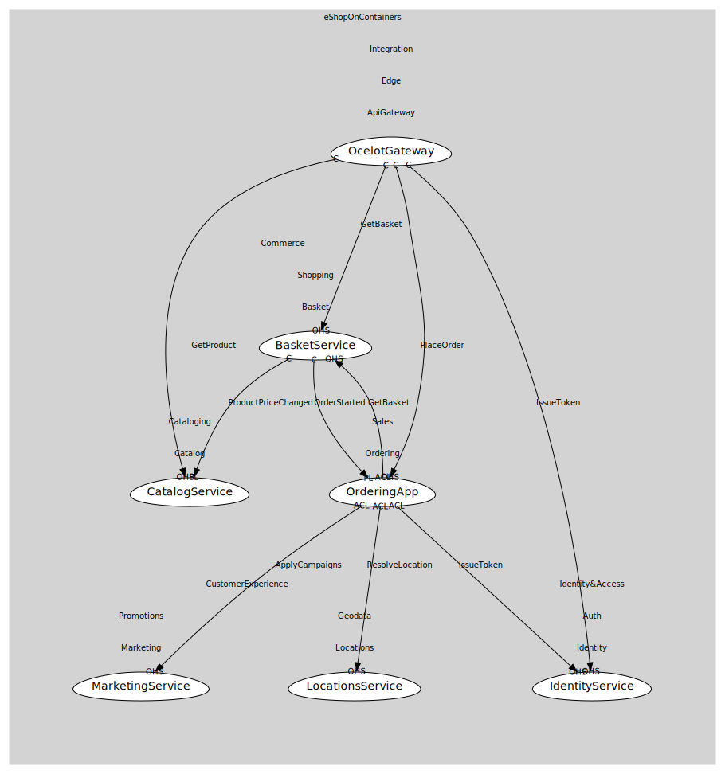

# OcelotGateway
Edge routing (conforming to downstream contracts)

## Provides
> No consumables.

## Consumes

### GetProduct [conformist]
Fetch product by id/sku
- **Provider**: [CatalogService](../../../../../../../commerce/subdomains/cataloging/boundedcontexts/catalog/services/catalog_service/index.md)

### GetBasket [conformist]
Fetch buyer basket
- **Provider**: [BasketService](../../../../../../../commerce/subdomains/shopping/boundedcontexts/basket/services/basket_service/index.md)

### PlaceOrder [conformist]
Submit order -> OrderStarted
- **Provider**: [OrderingApp](../../../../../../../commerce/subdomains/sales/boundedcontexts/ordering/services/ordering_app/index.md)

### IssueToken [conformist]
Exchange creds for JWT
- **Provider**: [IdentityService](../../../../../../../identity&access/subdomains/auth/boundedcontexts/identity/services/identity_service/index.md)

	
