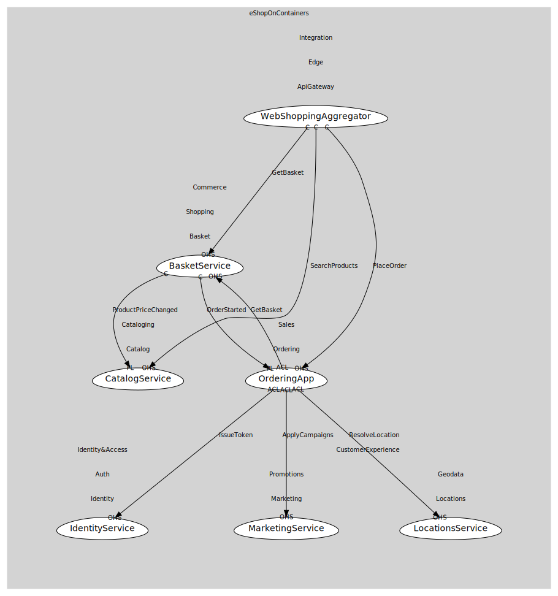

# WebShoppingAggregator
Aggregates Orders/Basket/Catalog

## Provides
> No consumables.

## Consumes

### GetBasket [conformist]
Fetch buyer basket
- **Provider**: [BasketService](../../../../../../../commerce/subdomains/shopping/boundedcontexts/basket/services/basket_service/index.md)

### SearchProducts [conformist]
Filter & paging
- **Provider**: [CatalogService](../../../../../../../commerce/subdomains/cataloging/boundedcontexts/catalog/services/catalog_service/index.md)

### PlaceOrder [conformist]
Submit order -> OrderStarted
- **Provider**: [OrderingApp](../../../../../../../commerce/subdomains/sales/boundedcontexts/ordering/services/ordering_app/index.md)

	
