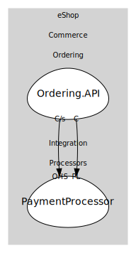

# PaymentProcessor
Simulated external payment provider. In a real system this would be a third-party gateway. Here it processes requests and publishes results for Ordering to react to.

## Aggregates
> No aggregates.
	
## Services

### [PaymentService](services/payment_service/index.md)
Application boundary that receives payment requests and emits success/failure outcomes based on simple rules.

## Relationships
| Consumer | Consumed As | Provider | Consumable | Provided As |
| --- | --- | --- | --- | --- |
| [OrderingService](../../../../../commerce/subdomains/ordering/boundedcontexts/ordering.api/services/ordering_service/index.md) | customer-supplier | PaymentService | ProcessPayment | open-host-service |
| [OrderingService](../../../../../commerce/subdomains/ordering/boundedcontexts/ordering.api/services/ordering_service/index.md) | conformist | PaymentService | PaymentSucceeded | published-language |

