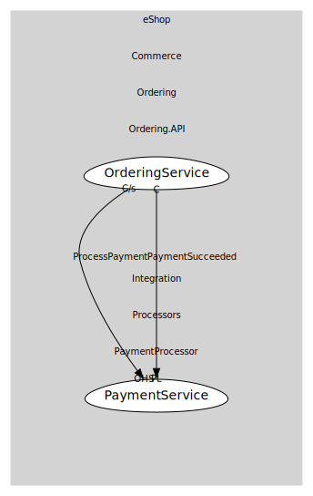

# PaymentService
Application boundary that receives payment requests and emits success/failure outcomes based on simple rules.

## Provides

### (operation) - ProcessPayment [open-host-service]
Command representing a request to authorize/charge an order total. Ordering is the customer; PaymentProcessor is the supplier.

### (event) - PaymentSucceeded [published-language]
Published when the processor approves a payment. Ordering consumes this to mark the order as paid and emit OrderPaid.

## Consumes
> No consumptions.
	
