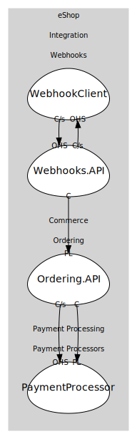

# WebhookClient
Sample receiver app for incoming webhook deliveries.

## Aggregates
> No aggregates.
	
## Services

### [WebhookReceiver](services/webhook_receiver/index.md)
Receives webhook POSTs.

## Relationships
| Consumer | Consumed As | Provider | Consumable | Provided As |
| --- | --- | --- | --- | --- |
| [WebhooksService](../webhooks.api/services/webhooks_service/index.md) | customer-supplier | WebhookReceiver | ReceiveWebhook | open-host-service |
| [WebhookReceiver](services/webhook_receiver/index.md) | customer-supplier | WebhooksService | RegisterWebhook | open-host-service |
| [WebhooksService](../webhooks.api/services/webhooks_service/index.md) | conformist | OrderingService | OrderPaid | published-language |
| [OrderingService](../../../../../commerce/subdomains/ordering/boundedcontexts/ordering.api/services/ordering_service/index.md) | customer-supplier | PaymentService | ProcessPayment | open-host-service |
| [OrderingService](../../../../../commerce/subdomains/ordering/boundedcontexts/ordering.api/services/ordering_service/index.md) | conformist | PaymentService | PaymentSucceeded | published-language |

