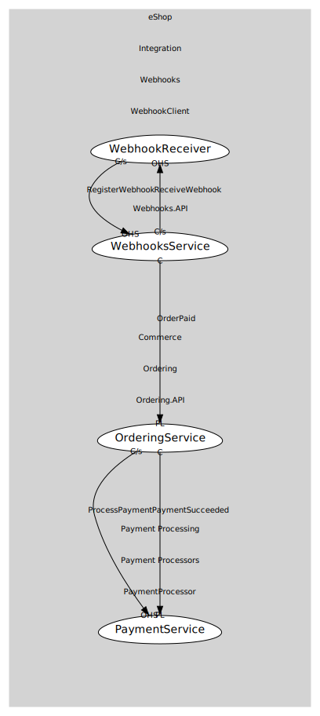

# WebhookReceiver
Receives webhook POSTs.

## Provides

### (operation) - ReceiveWebhook [open-host-service]
Endpoint to receive webhook deliveries.

## Consumes

### RegisterWebhook [customer-supplier]
Register a webhook endpoint for an event (e.g., OrderPaid).
- **Provider**: [WebhooksService](../../../webhooks.api/services/webhooks_service/index.md)

	
