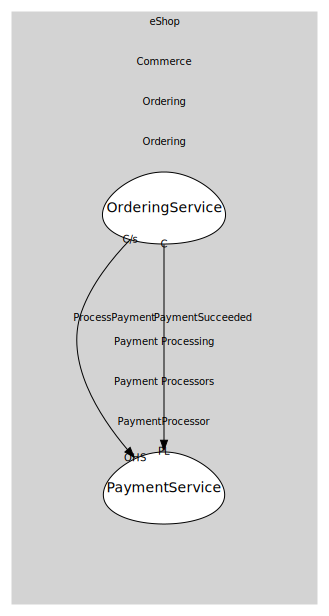

# PaymentService
Takes payments and emits status changes.

## Provides

### (operation) - ProcessPayment [open-host-service]
Process/authorize payment for an order.

### (event) - PaymentSucceeded [published-language]
Integration event when a payment is successful.

## Consumes
> No consumptions.
	
