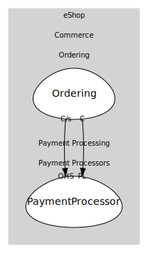

# Payment Processors
Background processors that integrate with external systems.

## Bounded Contexts

### [PaymentProcessor](boundedcontexts/payment_processor/index.md)
Simulated external payment processor.

## Relationships
| Consumer | Consumed As | Provider | Consumable | Provided As |
| --- | --- | --- | --- | --- |
| [OrderingService](../../../commerce/subdomains/ordering/boundedcontexts/ordering/services/ordering_service/index.md) | customer-supplier | PaymentService | ProcessPayment | open-host-service |
| [OrderingService](../../../commerce/subdomains/ordering/boundedcontexts/ordering/services/ordering_service/index.md) | conformist | PaymentService | PaymentSucceeded | published-language |
	
	
