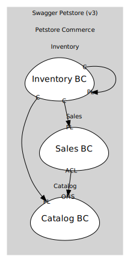

# Petstore Commerce (core)
Core pet catalog, sales, and inventory capabilities

## Subdomains

### [Catalog](subdomains/catalog/index.md)
Pet definitions, attributes, lifecycle

### [Sales](subdomains/sales/index.md)
Orders and order lifecycle

### [Inventory](subdomains/inventory/index.md)
Aggregated availability by status

## Relationships
| Consumer | Consumed As | Provider | Consumable | Provided As |
| --- | --- | --- | --- | --- |
| [OrderApp](subdomains/sales/boundedcontexts/sales_bc/services/order_app/index.md) | anti-corruption-layer | PetApp | GetPetSummary | open-host-service |
| [InventoryProjection](subdomains/inventory/boundedcontexts/inventory_bc/aggregates/inventory_projection/index.md) | conformist | Pet | PetRegistered | published-language |
| [InventoryProjection](subdomains/inventory/boundedcontexts/inventory_bc/aggregates/inventory_projection/index.md) | conformist | Pet | PetStatusChanged | published-language |
| [InventoryProjection](subdomains/inventory/boundedcontexts/inventory_bc/aggregates/inventory_projection/index.md) | conformist | Pet | PetDeleted | published-language |
| [InventoryProjection](subdomains/inventory/boundedcontexts/inventory_bc/aggregates/inventory_projection/index.md) | conformist | Order | OrderApproved | published-language |
| [InventoryProjection](subdomains/inventory/boundedcontexts/inventory_bc/aggregates/inventory_projection/index.md) | conformist | Order | OrderDelivered | published-language |
| [InventoryProjection](subdomains/inventory/boundedcontexts/inventory_bc/aggregates/inventory_projection/index.md) | conformist | Order | OrderDeleted | published-language |
| [InventoryQuery](subdomains/inventory/boundedcontexts/inventory_bc/services/inventory_query/index.md) | conformist | InventoryProjection | InventoryUpdated | published-language |

	
