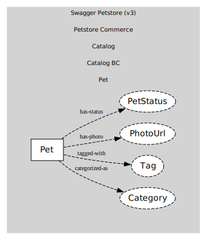

# Pet
A pet listed in the store

## Entities and Value Objects
| Type | Name | Description |
| --- | --- | --- |
| Entity (Root) | **Pet** | Pet root entity |
| Value Object | Category | { id?: number, name?: string } |
| Value Object | Tag | { id?: number, name?: string } |
| Value Object | PhotoUrl | string (URL) |
| Value Object | PetStatus | 'available' | 'pending' | 'sold' |

## Relationships
| Source | Description | Target | Relation |
| --- | --- | --- | --- |
| [Pet](entities/pet/index.md) | categorized-as | Pet - Category | uses |
| [Pet](entities/pet/index.md) | tagged-with | Pet - Tag | uses |
| [Pet](entities/pet/index.md) | has-photo | Pet - PhotoUrl | uses |
| [Pet](entities/pet/index.md) | has-status | Pet - PetStatus | uses |

## Invariants
| Name | Description |
| --- | --- |
| NameRequired | Pet.name must be non-empty |
| SoldNotReopen | Once sold, do not revert to available without explicit policy |

## Provides

### (event) - PetRegistered [published-language]
A new pet was registered

### (event) - PetUpdated [published-language]
Pet profile updated

### (event) - PetStatusChanged [published-language]
Pet status changed (available|pending|sold)

### (event) - PetPhotoUploaded [published-language]
Photo added via upload

### (event) - PetDeleted [published-language]
Pet removed from catalog

## Consumes
> No consumptions.
	
