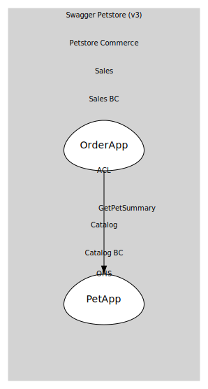

# PetApp
Open-host service for /pet endpoints

## Provides

### (operation) - AddPet [open-host-service]
POST /pet

### (operation) - UpdatePet [open-host-service]
PUT /pet

### (operation) - FindPetsByStatus [open-host-service]
GET /pet/findByStatus?status=available|pending|sold

### (operation) - FindPetsByTags [open-host-service]
GET /pet/findByTags?tags=tag1,tag2

### (operation) - GetPetById [open-host-service]
GET /pet/{petId}

### (operation) - UploadPetImage [open-host-service]
POST /pet/{petId}/uploadImage (multipart: additionalMetadata, file)

### (operation) - DeletePet [open-host-service]
DELETE /pet/{petId}

### (operation) - GetPetSummary [open-host-service]
Internal: {id,name,status} for ACL checks

## Consumes
> No consumptions.
	
