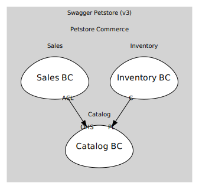

# Catalog
Pet definitions, attributes, lifecycle

## Bounded Contexts

### [Catalog BC](boundedcontexts/catalog_bc/index.md)
Owns Pet aggregate & pet-facing operations

## Relationships
| Consumer | Consumed As | Provider | Consumable | Provided As |
| --- | --- | --- | --- | --- |
| [OrderApp](../sales/boundedcontexts/sales_bc/services/order_app/index.md) | anti-corruption-layer | PetApp | GetPetSummary | open-host-service |
| [InventoryProjection](../inventory/boundedcontexts/inventory_bc/aggregates/inventory_projection/index.md) | conformist | Pet | PetRegistered | published-language |
| [InventoryProjection](../inventory/boundedcontexts/inventory_bc/aggregates/inventory_projection/index.md) | conformist | Pet | PetStatusChanged | published-language |
| [InventoryProjection](../inventory/boundedcontexts/inventory_bc/aggregates/inventory_projection/index.md) | conformist | Pet | PetDeleted | published-language |
	
	
