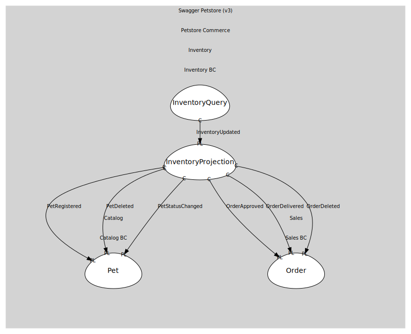

# InventoryProjection
Materialized view: { available: number, pending: number, sold: number }

## Entities and Value Objects
| Type | Name | Description |
| --- | --- | --- |
| Entity (Root) | **InventoryView** | Status→count map for /store/inventory |

## Relationships

## Invariants
> No invariants.

## Provides

### (event) - InventoryUpdated [published-language]
Inventory counts changed

## Consumes

### PetRegistered [conformist]
A new pet was registered
- **Provider**: [Pet](../../../../../catalog/boundedcontexts/catalog_bc/aggregates/pet/index.md)

### PetDeleted [conformist]
Pet removed from catalog
- **Provider**: [Pet](../../../../../catalog/boundedcontexts/catalog_bc/aggregates/pet/index.md)

### PetStatusChanged [conformist]
Pet status changed (available|pending|sold)
- **Provider**: [Pet](../../../../../catalog/boundedcontexts/catalog_bc/aggregates/pet/index.md)

### OrderApproved [conformist]
Order approved (status=approved)
- **Provider**: [Order](../../../../../sales/boundedcontexts/sales_bc/aggregates/order/index.md)

### OrderDelivered [conformist]
Order delivered (status=delivered)
- **Provider**: [Order](../../../../../sales/boundedcontexts/sales_bc/aggregates/order/index.md)

### OrderDeleted [conformist]
Order deleted via DELETE /store/order/{orderId}
- **Provider**: [Order](../../../../../sales/boundedcontexts/sales_bc/aggregates/order/index.md)

	
