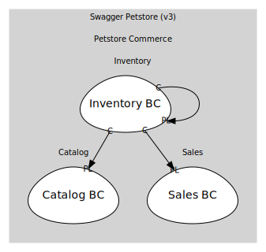

# Inventory BC
Projection for /store/inventory (status→count)

## Aggregates

### [InventoryProjection](aggregates/inventory_projection/index.md)
Materialized view: { available: number, pending: number, sold: number }

	
## Services

### [InventoryQuery](services/inventory_query/index.md)
Open-host service for /store/inventory

## Relationships
| Consumer | Consumed As | Provider | Consumable | Provided As |
| --- | --- | --- | --- | --- |
| [InventoryQuery](services/inventory_query/index.md) | conformist | InventoryProjection | InventoryUpdated | published-language |
| [InventoryProjection](aggregates/inventory_projection/index.md) | conformist | Pet | PetRegistered | published-language |
| [InventoryProjection](aggregates/inventory_projection/index.md) | conformist | Pet | PetDeleted | published-language |
| [InventoryProjection](aggregates/inventory_projection/index.md) | conformist | Pet | PetStatusChanged | published-language |
| [InventoryProjection](aggregates/inventory_projection/index.md) | conformist | Order | OrderApproved | published-language |
| [InventoryProjection](aggregates/inventory_projection/index.md) | conformist | Order | OrderDelivered | published-language |
| [InventoryProjection](aggregates/inventory_projection/index.md) | conformist | Order | OrderDeleted | published-language |

