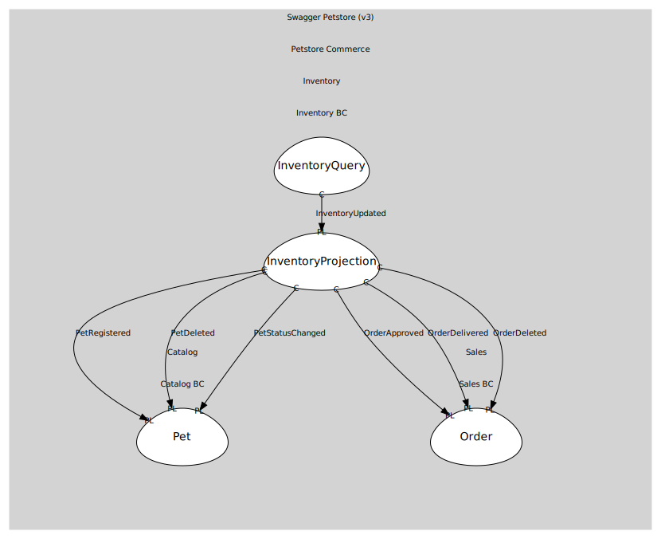

# InventoryQuery
Open-host service for /store/inventory

## Provides

### (operation) - GetInventory [open-host-service]
GET /store/inventory → { [status]: count }

## Consumes

### InventoryUpdated [conformist]
Inventory counts changed
- **Provider**: [InventoryProjection](../../aggregates/inventory_projection/index.md)

	
