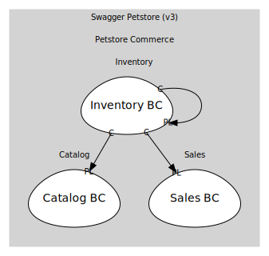

# Inventory
Aggregated availability by status

## Bounded Contexts

### [Inventory BC](boundedcontexts/inventory_bc/index.md)
Projection for /store/inventory (status→count)

## Relationships
| Consumer | Consumed As | Provider | Consumable | Provided As |
| --- | --- | --- | --- | --- |
| [InventoryQuery](boundedcontexts/inventory_bc/services/inventory_query/index.md) | conformist | InventoryProjection | InventoryUpdated | published-language |
| [InventoryProjection](boundedcontexts/inventory_bc/aggregates/inventory_projection/index.md) | conformist | Pet | PetRegistered | published-language |
| [InventoryProjection](boundedcontexts/inventory_bc/aggregates/inventory_projection/index.md) | conformist | Pet | PetDeleted | published-language |
| [InventoryProjection](boundedcontexts/inventory_bc/aggregates/inventory_projection/index.md) | conformist | Pet | PetStatusChanged | published-language |
| [InventoryProjection](boundedcontexts/inventory_bc/aggregates/inventory_projection/index.md) | conformist | Order | OrderApproved | published-language |
| [InventoryProjection](boundedcontexts/inventory_bc/aggregates/inventory_projection/index.md) | conformist | Order | OrderDelivered | published-language |
| [InventoryProjection](boundedcontexts/inventory_bc/aggregates/inventory_projection/index.md) | conformist | Order | OrderDeleted | published-language |
	
	
