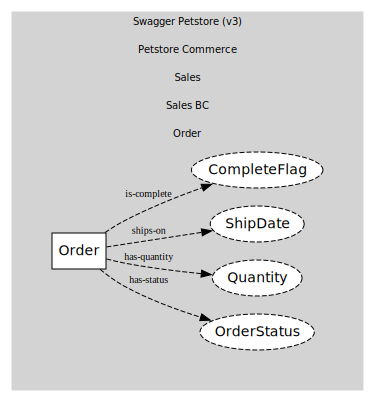
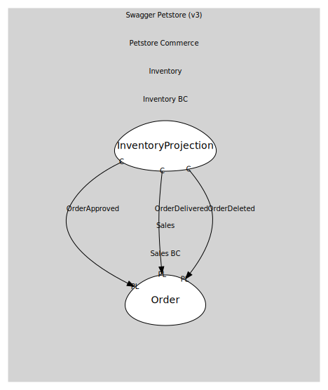

# Order
Order for a single pet

## Entities and Value Objects
| Type | Name | Description |
| --- | --- | --- |
| Entity (Root) | **Order** | Order root entity |
| Value Object | OrderStatus | 'placed' | 'approved' | 'delivered' |
| Value Object | Quantity | int > 0 |
| Value Object | ShipDate | date-time |
| Value Object | CompleteFlag | boolean |

## Relationships
| Source | Description | Target | Relation |
| --- | --- | --- | --- |
| [Order](entities/order/index.md) | has-status | Order - OrderStatus | uses |
| [Order](entities/order/index.md) | has-quantity | Order - Quantity | uses |
| [Order](entities/order/index.md) | ships-on | Order - ShipDate | uses |
| [Order](entities/order/index.md) | is-complete | Order - CompleteFlag | uses |

## Invariants
| Name | Description |
| --- | --- |
| QuantityPositive | Quantity must be > 0 |
| ApproveOnlyWhenAvailable | Approve only if Pet.status == available |
| DeliverOnlyWhenApproved | Deliver only from approved |

## Provides

### (event) - OrderPlaced [published-language]
Order created (status=placed)

### (event) - OrderApproved [published-language]
Order approved (status=approved)

### (event) - OrderDelivered [published-language]
Order delivered (status=delivered)

### (event) - OrderDeleted [published-language]
Order deleted via DELETE /store/order/{orderId}

## Consumes
> No consumptions.
	
