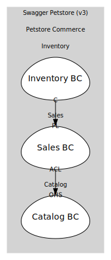

# Sales BC
Owns Order aggregate & order-facing operations

## Aggregates

### [Order](aggregates/order/index.md)
Order for a single pet

	
## Services

### [OrderApp](services/order_app/index.md)
Open-host service for /store/order endpoints

## Relationships
| Consumer | Consumed As | Provider | Consumable | Provided As |
| --- | --- | --- | --- | --- |
| [OrderApp](services/order_app/index.md) | anti-corruption-layer | PetApp | GetPetSummary | open-host-service |
| [InventoryProjection](../../../inventory/boundedcontexts/inventory_bc/aggregates/inventory_projection/index.md) | conformist | Order | OrderApproved | published-language |
| [InventoryProjection](../../../inventory/boundedcontexts/inventory_bc/aggregates/inventory_projection/index.md) | conformist | Order | OrderDelivered | published-language |
| [InventoryProjection](../../../inventory/boundedcontexts/inventory_bc/aggregates/inventory_projection/index.md) | conformist | Order | OrderDeleted | published-language |

